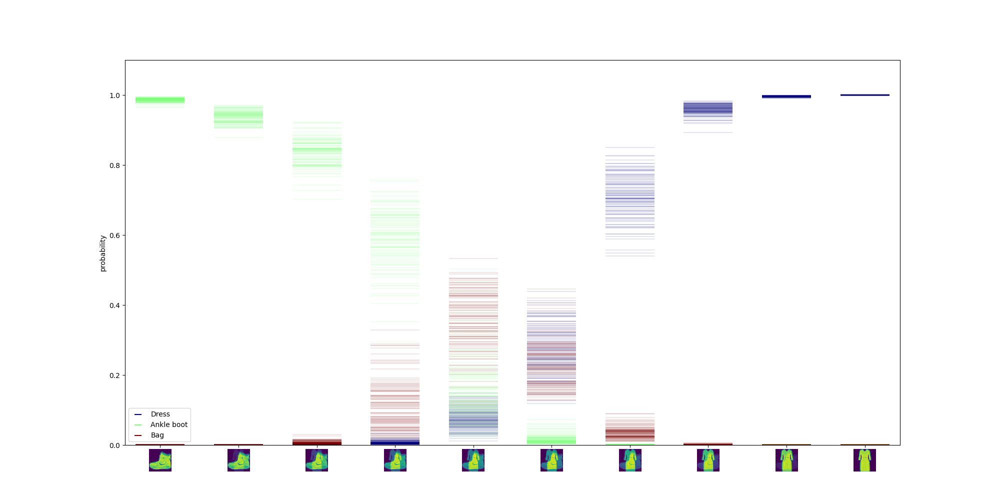

<div align="center">

# Dropout-models-uncertainty

<p align="center">
    Experiments for modeling uncertainty with dropout research.
    <br />
    <i>Project made for Deep Learning classes</i>
    <br/>
    <b>Date of completion: 📆 24.01.2024 📆</b>
  </p>

</div>

## About The Project

The goal of the project was to create relevant experiments to extend the scientific work [Gal, Y and Ghahramani, Z. Dropout as a Bayesian Approximation:
Representing Model Uncertainty in Deep Learning](https://arxiv.org/pdf/1506.02142.pdf). We reproduced the research described in the aforementioned paper, and also checked whether we were able to obtain similar results using other dropout techniques.

We will soon describe the results of the experiments in a corresponding blog post!

## Technologies Used


## Installation

Poetry is used to manage dependencies for this repository. Check if poetry is installed on your machine using command:

```
poetry --version
```

If version of the poetry was displayed, you can install all required packages using command:

```
poetry install
```

To install poetry on your machine see [documentation](https://python-poetry.org/docs/cli/#install).

All code should be ran in the env created by the poetry. To ensure that you are running scripts in the env created by poetry run command:

```
poetry shell
```

## Installing new modules
Instead of using *pip install module_name*
Use:
```
poetry add module_name
```

## MLFlow
Run MLFlow tool inside virtual environment created by poetry:
```
mlflow ui
```

## Example results
The chart below illustrates the performance of our algorithm for arbitrarily chosen hyperparameters. This is a perfect example of correctly modeling uncertainty using the dropout technique. 

 

Our project allows user to generate its own, custom charts for user-selected hyperparameters.